# ForgeCC — Architecture & Technology

## 1. Architecture Overview

ForgeCC is designed as a compiler built on top of LLVM.

The architecture separates the compiler into several layers:

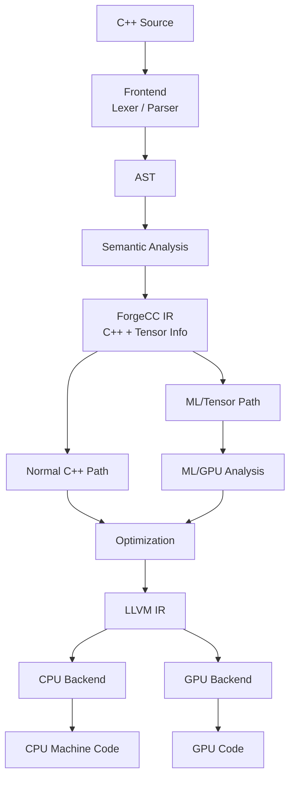

---

# 2. LLVM Architecture

LLVM is the foundation of ForgeCC.

A simplified LLVM-based compilation pipeline is:

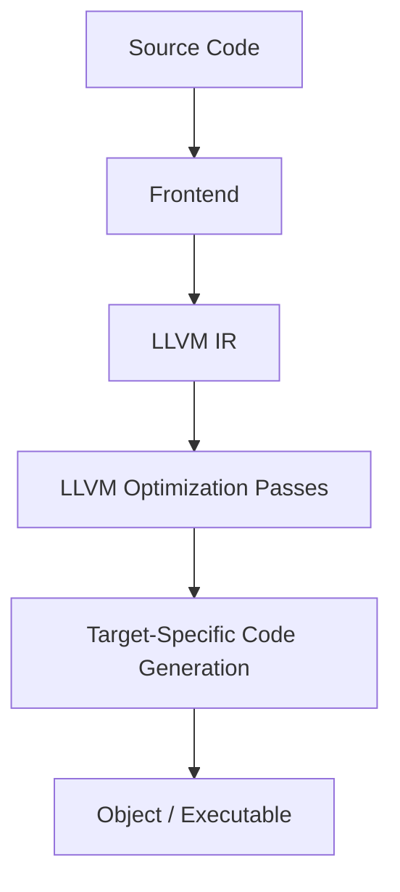

ForgeCC adds additional layers before and around LLVM IR.

---

# 3. ForgeCC + LLVM

The relationship should be:

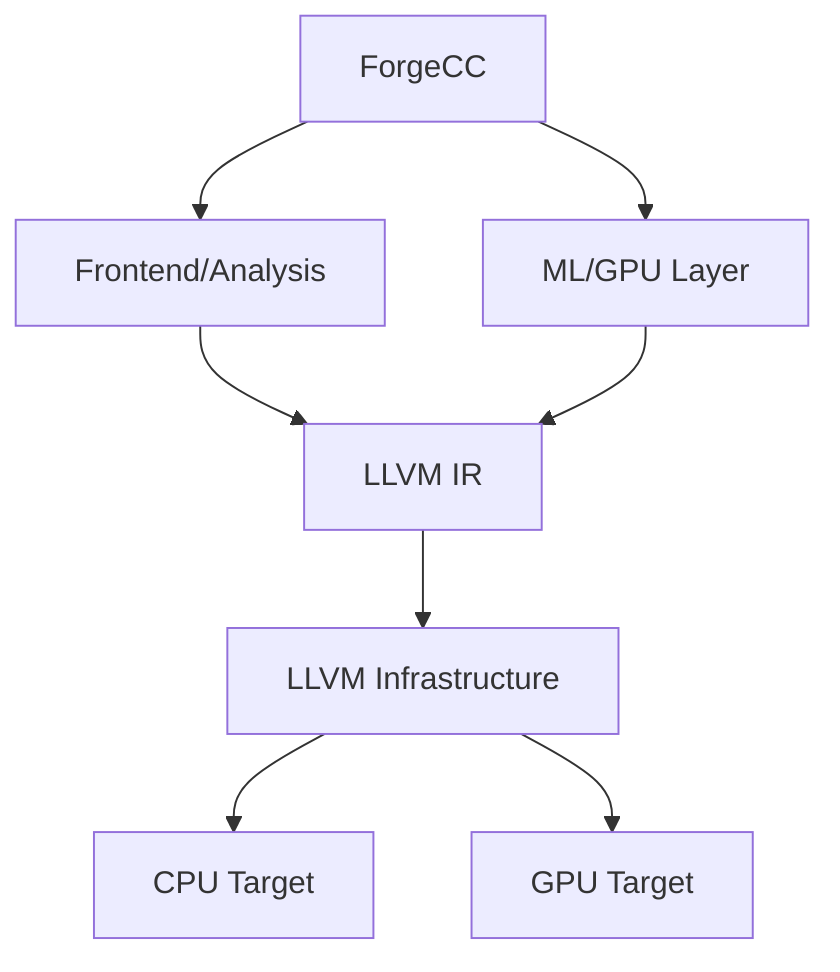

ForgeCC does not need to rewrite LLVM's existing optimizer or CPU backend.

Instead, it should use LLVM's APIs and extension mechanisms.

---

# 4. Compiler Stages

## 4.1 Lexical Analysis

The lexer converts source text into tokens.

Example:

```cpp
auto C = A + B;
```

becomes conceptually:

```text
auto
C
=
A
+
B
;
```

For the initial implementation, an existing LLVM-compatible frontend strategy can be used where appropriate. A custom language/frontend should only be introduced where ForgeCC needs behavior beyond standard C++.

---

# 5. Parsing

The parser converts tokens into an AST.

Example:

```cpp
C = A + B;
```

becomes conceptually:

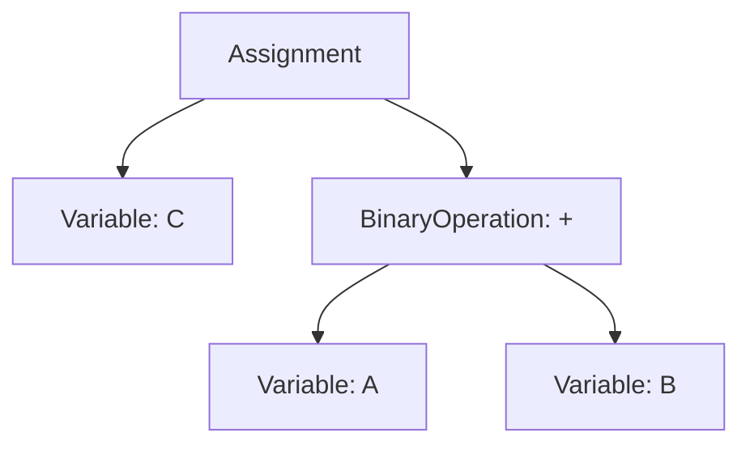

The AST is the foundation for semantic analysis.

---

# 6. Semantic Analysis

Semantic analysis determines what the program means.

It handles concepts such as:

- Types
- Scope
- Symbol resolution
- Function calls
- Variable declarations
- Type compatibility
- Template information where applicable

For ForgeCC, semantic analysis will also eventually identify tensor-related types and operations.

Example:

```cpp
Tensor<float> A;
Tensor<float> B;

auto C = matmul(A, B);
```

The compiler should know:

```text
A → Tensor<float>
B → Tensor<float>
matmul → Tensor operation
C → Tensor<float>
```

---

# 7. ForgeCC Intermediate Representation

ForgeCC should introduce a compiler-level representation for GPU/ML-aware operations.

Example:

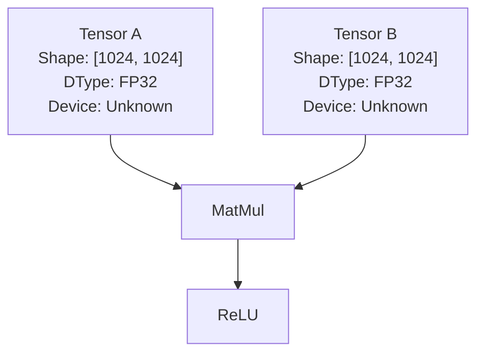

A possible conceptual IR:

```text
%0 = tensor.load A
%1 = tensor.load B
%2 = tensor.matmul %0, %1
%3 = tensor.relu %2
```

This is not necessarily the final textual syntax. The actual IR representation will be implemented as C++ data structures and compiler objects.

---

# 8. Tensor Representation

A tensor should contain information such as:

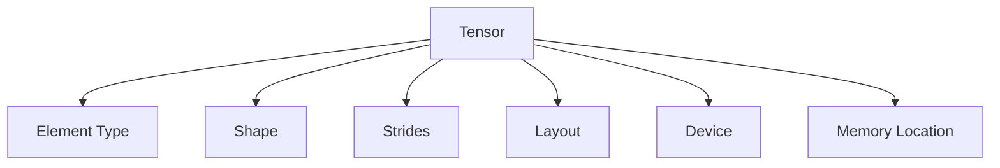

Example:

```text
Tensor<float>
Shape: [32, 224, 224, 3]
Layout: NHWC
Device: GPU
```

This information is important for optimization and code generation.

---

# 9. ML Operations

The first ML-aware operations should be small in number.

### Initial operations

```text
MatMul
Add
Mul
Sub
Div
ReLU
Transpose
Reshape
Reduce
```

Later:

```text
Conv2D
Softmax
LayerNorm
GELU
Attention
```

The compiler should treat these as high-level operations before lowering them to lower-level instructions.

---

# 10. Optimization Pipeline

ForgeCC will contain optimization passes before final lowering.

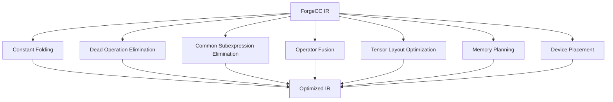

---

# 11. Operator Fusion

Example:

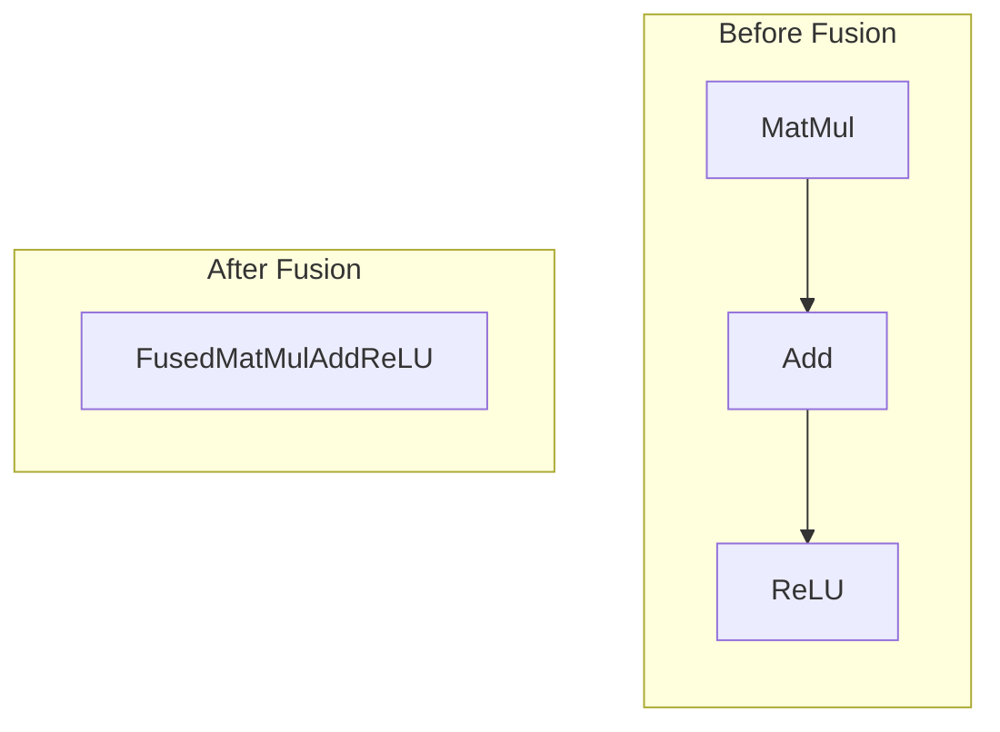

This reduces intermediate memory operations and potentially reduces GPU kernel launches.

---

# 12. Device Placement

Each operation can eventually receive a device assignment:

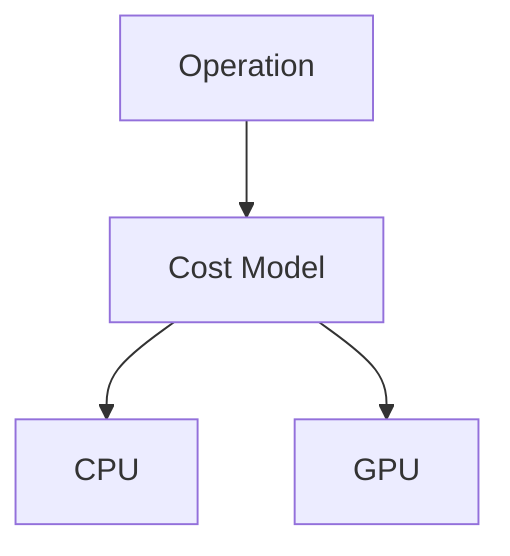

The compiler considers:

- Computation size
- Data movement
- Existing tensor location
- GPU availability
- Operation type
- Kernel overhead

Example:

```text
Tensor A: GPU
Tensor B: GPU

MatMul: GPU
Add: GPU
ReLU: GPU

Result: GPU
```

The compiler avoids unnecessary:

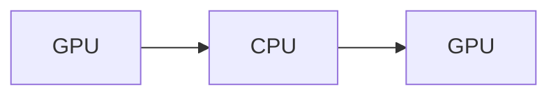

transfers.

---

# 13. Memory Architecture

The compiler must understand two major memory domains:

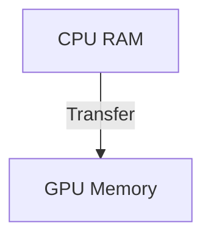

A future memory planner should determine:

- Allocation
- Deallocation
- Buffer reuse
- Tensor lifetime
- Host/device transfers
- Alignment
- Memory layout

---

# 14. LLVM IR Lowering

After ForgeCC-specific optimization:

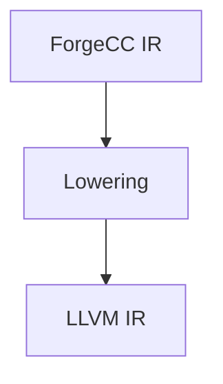

For CPU-compatible operations, LLVM IR can be generated directly.

Conceptually:

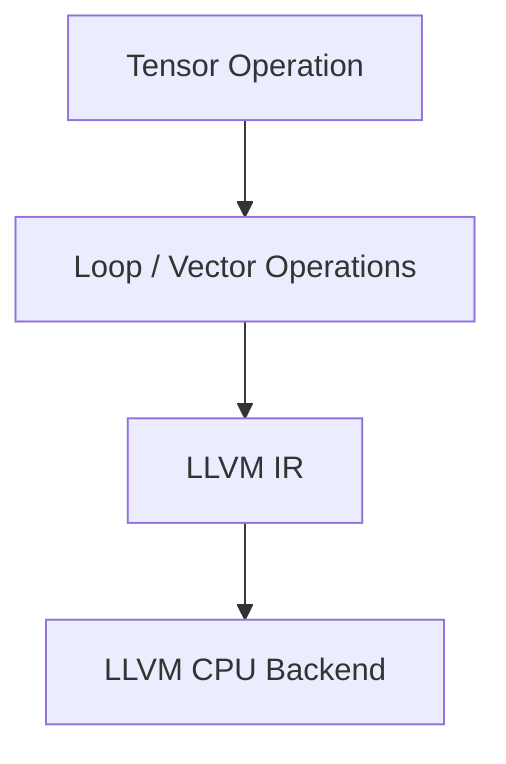

---

# 15. GPU Backend

The GPU backend is a separate component.

Conceptually:

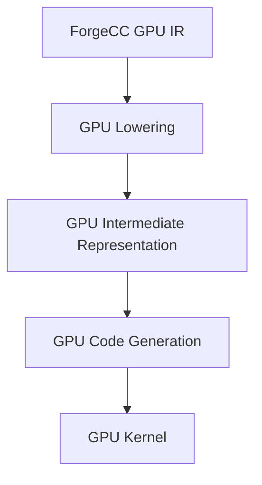

The first implementation should target **one GPU ecosystem**.

Multi-vendor support should come later.

---

# 16. GPU Runtime

Compilation alone is not enough.

The runtime handles:

```text
Device Discovery
Memory Allocation
Memory Transfer
Kernel Launch
Synchronization
Result Retrieval
```

Architecture:

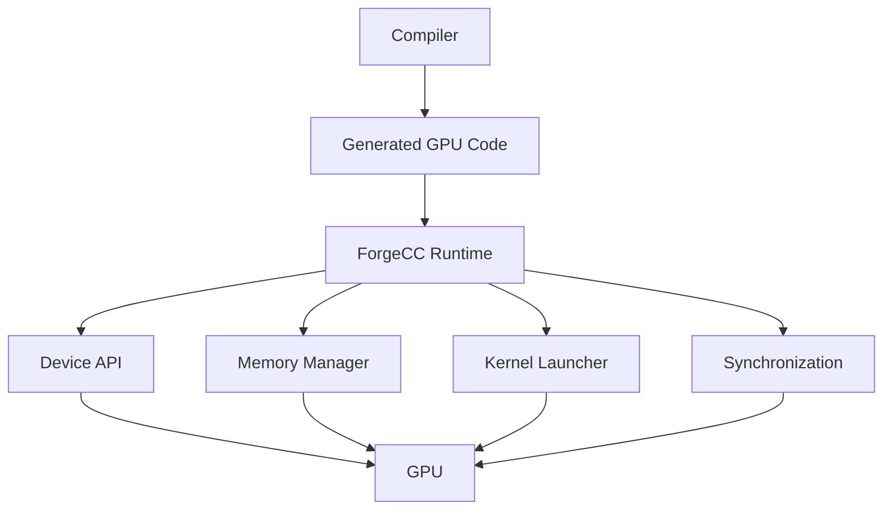

---

# 17. Technology Stack

## Core

| Component | Technology |
|---|---|
| Language | C++ |
| Compiler Infrastructure | LLVM |
| Build System | CMake |
| Testing | GoogleTest / LLVM testing infrastructure |
| Version Control | Git |
| Debugging | LLDB / platform debugger |

## Compiler

```text
C++
LLVM IR
LLVM PassManager
LLVM IRBuilder
LLVM Target APIs
LLVM Code Generation
```

## ML Layer

Initially:

```text
Custom Tensor IR
Custom ML operations
Shape analysis
Device analysis
Cost model
```

Potential future integrations:

```text
MLIR
ONNX
PyTorch graph formats
```

These should be considered later rather than making them dependencies of V1.

---

# 18. Project Directory

```text
ForgeCC/
│
├── CMakeLists.txt
├── README.md
│
├── docs/
│   ├── idea.md
│   └── architecture.md
│
├── include/
│   ├── frontend/
│   ├── ast/
│   ├── sema/
│   ├── ir/
│   ├── optimizer/
│   ├── codegen/
│   ├── gpu/
│   └── runtime/
│
├── src/
│   ├── frontend/
│   ├── ast/
│   ├── sema/
│   ├── ir/
│   ├── optimizer/
│   ├── codegen/
│   ├── gpu/
│   └── runtime/
│
├── tests/
│   ├── frontend/
│   ├── ir/
│   ├── optimizer/
│   ├── codegen/
│   └── gpu/
│
├── examples/
│   ├── hello.cpp
│   ├── matmul.cpp
│   └── tensor.cpp
│
└── tools/
    └── forgecc/
```

---

# 19. Compiler Executable

The main compiler executable will eventually be:

```text
forgecc
```

Example:

```bash
forgecc program.cpp -o program
```

GPU-oriented compilation could eventually use:

```bash
forgecc program.cpp --target=gpu -o program
```

Debug/IR output:

```bash
forgecc program.cpp --emit-ir
```

Optimization diagnostics:

```bash
forgecc program.cpp --dump-passes
```

The exact CLI will be finalized during implementation.

---

# 20. Development Phases

## Phase 1 — LLVM Foundation

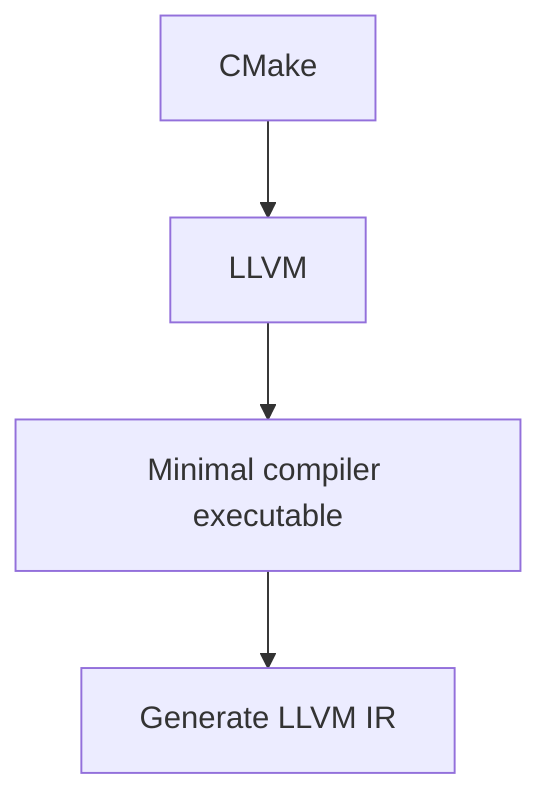

## Phase 2 — Compiler Frontend

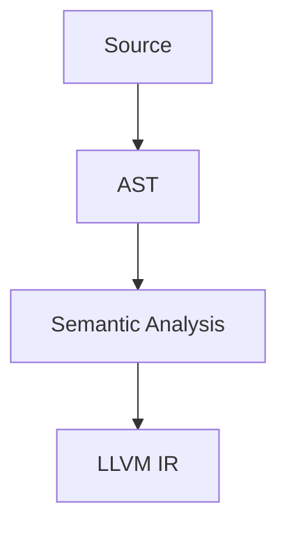

## Phase 3 — Custom IR

Add:

```text
Tensor
Operation
Graph
Module
Shape
DType
Device
```

## Phase 4 — Optimization

Implement:

```text
Constant Folding
Dead Code Elimination
Operator Fusion
Shape Analysis
Memory Planning
```

## Phase 5 — GPU Backend

Start with one GPU target:

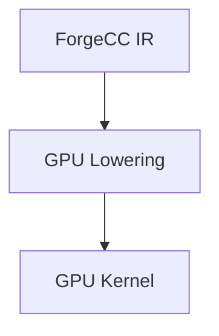

## Phase 6 — Runtime

Implement:

```text
Device discovery
Memory allocation
Transfers
Kernel launch
Synchronization
```

## Phase 7 — Hardware-Aware Compilation

Introduce:

```text
Cost Model
Device Placement
Memory-aware Optimization
Kernel Selection
```

---

# 21. Long-Term Architecture

The final architecture should look approximately like:

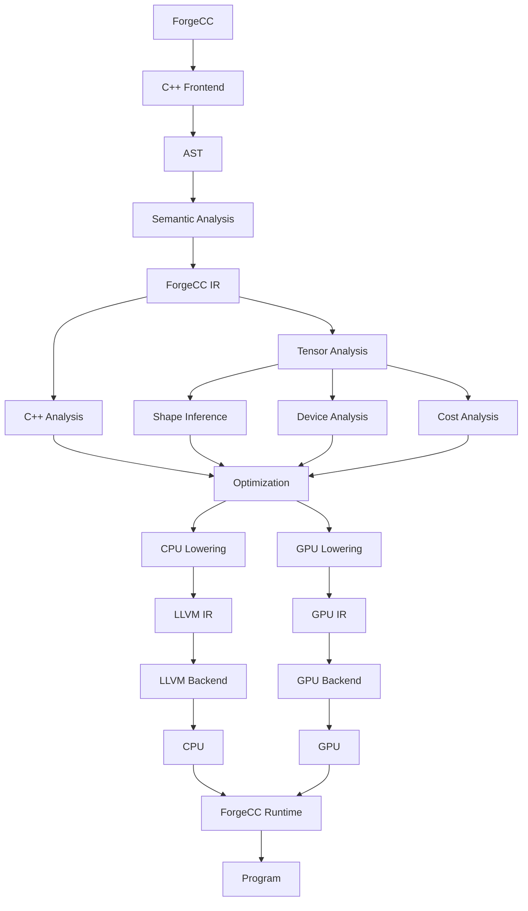

---

# 22. Core Design Principle

The central design principle of ForgeCC is:

> **Keep high-level information alive for as long as possible, optimize using that information, and lower to machine-specific code only when necessary.**

For example:

```text
MatMul(A, B)
```

contains more useful information than immediately lowering it into:

```text
loads
multiplies
adds
stores
```

ForgeCC should exploit the high-level representation to make better decisions about:

- CPU vs GPU
- Kernel fusion
- Memory placement
- Tensor layout
- Data types
- Parallelism

Only after these decisions should the compiler lower the computation toward machine-level code.
