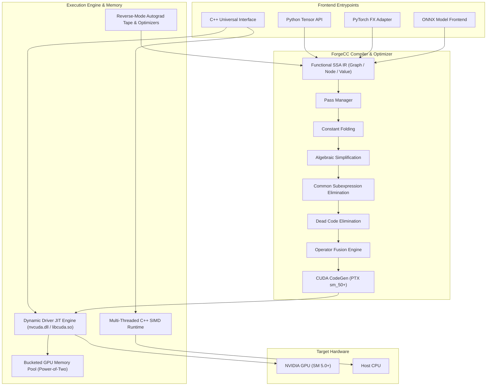

# ForgeCC — Complete Developer Guide & Architecture Overview

## 1. Executive Summary & Core Philosophy

ForgeCC is a framework-independent machine learning compiler and universal tensor acceleration runtime designed to compile and execute high-throughput neural network operations directly on NVIDIA GPUs and multi-threaded CPUs.

Modern machine learning stacks often suffer from severe deployment bloat, requiring multi-gigabyte CUDA Toolkits, complex compiler dependencies (such as heavy LLVM toolchains or MSVC/GCC environments), and high memory bandwidth overhead caused by unfused eager kernel execution.

ForgeCC resolves these bottlenecks through three core design principles:

1. **Zero-SDK Dynamic Driver Execution:** Eliminates external CUDA Toolkit installations by interfacing directly with the standard NVIDIA display driver (`nvcuda.dll` on Windows, `libcuda.so` on Linux) using JIT-compiled PTX assembly.
2. **Register-Level Operator Fusion:** Fuses multi-stage linear algebra and activation sequences (such as Matrix Multiplication + Bias + Activation + Residual) directly within Streaming Multiprocessor (SM) registers, eliminating intermediate global VRAM roundtrips.
3. **Pure Python & Zero-Dependency Portability:** Features a standalone binary Protocol Buffer ONNX model parser, a built-in SSA IR pass manager, and a reverse-mode autograd tape without requiring third-party runtime frameworks.

---

## 2. Architectural Overview



---

## 3. How ForgeCC is Different

| Dimension | Standard PyTorch / TensorFlow | TorchInductor / Triton | TensorRT | ForgeCC Compiler Engine |
| :--- | :--- | :--- | :--- | :--- |
| **CUDA SDK Dependency** | Requires CUDA Toolkit (3 GB – 10 GB) | Requires CUDA Toolkit + MSVC/GCC toolchain | Requires CUDA Toolkit + TensorRT SDK | **Zero SDK requirement**: communicates directly with standard graphics driver |
| **Compiler Toolchain** | Heavy native wheel builds | Requires Python C++ compiler & Triton runtime | Vendor proprietary closed-source engine | **Zero external compiler**: generates clean PTX assembly and JIT-loads via driver API |
| **Execution Model** | Eager kernel dispatch | JIT Triton compilation | Graph capture engine | Dynamic SSA IR JIT + Register-Fused PTX Kernels |
| **ONNX Parsing** | Requires `onnx` and `protobuf` libraries | PyTorch importer only | TensorRT parser | **Zero-dependency binary Protobuf decoder** built directly into runtime |
| **Memory Management** | Framework caching allocator | Framework caching allocator | Static engine workspace | **Bucketed Power-of-Two GPU Memory Pool** with zero driver reallocation |
| **Fallback Mechanism** | Requires separate CPU builds | CPU compilation limited | No CPU fallback | **Seamless automatic fallback** to multi-threaded C++ SIMD engine |
| **Universal API** | Python / C++ LibTorch | Python only | C++ / Python | **Unified C++ universal interface and Python package** |

---

## 4. Key Architectural Innovations

### 4.1 Zero-SDK Dynamic Driver Execution
Traditional GPU acceleration requires installing the complete NVIDIA CUDA Toolkit, configuring environment paths (`CUDA_PATH`, `PATH`), and linking against `cudart.lib`.

ForgeCC completely bypasses the CUDA Toolkit:
- Dynamically locates and loads `nvcuda.dll` (Windows) or `libcuda.so` (Linux).
- Loads standard Driver API function pointers (`cuInit`, `cuDeviceGet`, `cuCtxCreate_v2`, `cuMemAlloc_v2`, `cuMemcpyHtoD_v2`, `cuModuleLoadDataEx`, `cuLaunchKernel`).
- Emits raw, optimized PTX assembly targeted at compute capability `sm_50` and above.
- JIT-compiles and launches PTX modules in microseconds at runtime.

### 4.2 Register-Level Operator Fusion
In eager deep learning frameworks, an operation sequence like:
$$\text{Output} = \text{ReLU}(A \cdot B + \text{bias}) + \text{residual}$$
launches 4 separate GPU kernels:
1. MatMul kernel writes $M \times N$ matrix to global VRAM.
2. Bias add kernel reads $M \times N$ from VRAM, adds bias, writes back to VRAM.
3. ReLU kernel reads $M \times N$ from VRAM, applies activation, writes back to VRAM.
4. Residual add kernel reads $M \times N$ from VRAM, adds residual, writes back to VRAM.

This produces 8 global memory transfers ($4 \times \text{write} + 4 \times \text{read}$), causing memory bandwidth starvation.

ForgeCC's fusion engine executes the entire sequence inside GPU Streaming Multiprocessor (SM) registers in a single kernel pass:
- Performs matrix tiled multiply-accumulate in shared memory and registers.
- Adds bias vector directly to the accumulator register.
- Evaluates activation ($\max(0, x)$) directly on the register value.
- Loads residual element and adds directly to the register value.
- Writes the final result to global VRAM once ($1 \times \text{read}, 1 \times \text{write}$).

### 4.3 Deterministic Power-of-Two GPU Memory Pool
Frequent calls to driver allocation routines (`cuMemAlloc` / `cudaMalloc`) introduce synchronization overhead and memory fragmentation.

ForgeCC incorporates an internal bucketed memory pool:
- Allocation sizes are rounded up to the nearest power of two ($2^{\lceil \log_2(S) \rceil}$).
- Released allocations are immediately returned to free buckets indexed by size.
- Subsequent allocations of matching bucket size are served in $O(1)$ time with zero driver calls.

---

## 5. Developer Recipes & Code Examples

### 5.1 Basic Tensor Arithmetic & GPU Execution

```python
import forgecc
import numpy as np

print("GPU Available:", forgecc.is_gpu_available())

a = forgecc.tensor([[1.0, 2.0], [3.0, 4.0]], device=forgecc.Device.GPU)
b = forgecc.tensor([[5.0, 6.0], [7.0, 8.0]], device=forgecc.Device.GPU)

c = a @ b
d = (c + 1.0).relu()

print("Computed Output:\n", d.numpy())
```

---

### 5.2 Direct Operator Fusion Execution

Execute fused matrix multiplication and epilogue operations in a single kernel launch:

```python
import forgecc
import numpy as np

M, K, N = 512, 512, 512
a = np.random.randn(M, K).astype(np.float32)
b = np.random.randn(K, N).astype(np.float32)
bias = np.random.randn(N).astype(np.float32)
residual = np.random.randn(M, N).astype(np.float32)

output = forgecc.matmul_add_relu_residual(a, b, bias, residual)
print("Fused Output Shape:", output.shape)
```

---

### 5.3 PyTorch Module Compilation (`@compile_torch_module`)

Accelerate existing PyTorch models with automated FX graph tracing and translation into ForgeCC SSA IR:

```python
import torch
import torch.nn as nn
import forgecc

class NeuralNet(nn.Module):
    def __init__(self):
        super().__init__()
        self.fc1 = nn.Linear(4, 8)
        self.relu = nn.ReLU()
        self.fc2 = nn.Linear(8, 2)

    def forward(self, x):
        return self.fc2(self.relu(self.fc1(x)))

torch_model = NeuralNet()
example_input = torch.randn(1, 4)

compiled_model = forgecc.compile_torch_module(torch_model, example_input, target="gpu")
output = compiled_model(example_input)

print("Compiled Output:", output)
```

---

### 5.4 Neural Network Training with Autograd & Optimizers

Train models end-to-end using ForgeCC's reverse-mode differentiation tape and native in-place optimizers (SGD, Adam, AdamW):

```python
import forgecc
import numpy as np

x = forgecc.tensor([[1.0, 2.0], [2.0, 3.0], [3.0, 4.0]], requires_grad=False)
y_true = forgecc.tensor([[1.0, 0.0], [0.0, 1.0], [1.0, 1.0]], requires_grad=False)

w1 = forgecc.tensor(np.random.randn(2, 4).astype(np.float32), requires_grad=True)
w2 = forgecc.tensor(np.random.randn(4, 2).astype(np.float32), requires_grad=True)

optimizer = forgecc.optim.AdamW([w1, w2], lr=0.01, weight_decay=0.01)

for epoch in range(50):
    optimizer.zero_grad()
    
    hidden = (x @ w1).relu()
    y_pred = (hidden @ w2).sigmoid()
    
    loss = forgecc.mse_loss(y_pred, y_true)
    loss.backward()
    
    optimizer.step()
    
    if epoch % 10 == 0:
        print(f"Epoch {epoch}: Loss = {float(loss.numpy().item()):.6f}")
```

---

### 5.5 Zero-Dependency ONNX Model Loading & Compilation

Load and compile standard ONNX models without installing third-party `onnx` or `protobuf` dependencies:

```python
import forgecc

compiled_model = forgecc.compile_onnx("model.onnx", target="gpu", optimize=True)

input_tensor = forgecc.tensor([[1.0, 2.0, 3.0, 4.0]])
output = compiled_model(input_tensor)

print("ONNX Inference Output:\n", output.numpy())
```

---

### 5.6 SSA IR Graph Tracing & Pass Optimization

Construct, optimize, and inspect computation graphs using the functional SSA IR:

```python
import forgecc

def compute_fn(x, y):
    z = x + y
    w = z * 2.0
    return w.relu()

graph = forgecc.trace(compute_fn, shape=(4, 4), dtype="float32")
print("Unoptimized Graph:\n", graph.to_string())

optimized_graph = forgecc.optimize(graph)
print("Optimized Graph:\n", optimized_graph.to_string())

compiled = forgecc.compile(optimized_graph, target="gpu")
```

---

### 5.7 C++ Native Universal Interface

Embed ForgeCC directly into native high-performance C++ pipelines:

```cpp
#include "forgecc_rt/gpu_runtime.hpp"
#include "forgecc_rt/tensor.hpp"
#include <iostream>
#include <vector>

int main() {
    int64_t M = 1024, K = 1024, N = 1024;
    
    std::vector<float> h_A(M * K, 1.0f);
    std::vector<float> h_B(K * N, 2.0f);
    std::vector<float> h_C(M * N, 0.0f);

    if (forge_gpu_is_available()) {
        void* d_A = forge_gpu_malloc(M * K * sizeof(float));
        void* d_B = forge_gpu_malloc(K * N * sizeof(float));
        void* d_C = forge_gpu_malloc(M * N * sizeof(float));

        forge_gpu_memcpy_to_device(d_A, h_A.data(), M * K * sizeof(float));
        forge_gpu_memcpy_to_device(d_B, h_B.data(), K * N * sizeof(float));

        forge_gpu_matmul_relu_fused((const float*)d_A, (const float*)d_B, (float*)d_C, M, K, N);
        forge_gpu_sync();

        forge_gpu_memcpy_to_host(h_C.data(), d_C, M * N * sizeof(float));

        forge_gpu_free(d_A);
        forge_gpu_free(d_B);
        forge_gpu_free(d_C);

        std::cout << "Computed first element: " << h_C[0] << std::endl;
    }
    return 0;
}
```

---

### 5.8 Standalone Compiler CLI Interface

Compile high-level tensor definitions into intermediate representations and native machine object files:

```cmd
build\tools\forgecc\forgecc.exe model.fcc --emit-forge-ir
build\tools\forgecc\forgecc.exe model.fcc --emit-ir
build\tools\forgecc\forgecc.exe model.fcc --emit-obj -o model_out
```

---

## 6. GPU Performance Benchmarking

### Benchmarking Fused Execution vs. Eager Frameworks

```python
import time
import torch
import forgecc
import numpy as np

M, K, N = 2048, 2048, 2048
ITERATIONS = 100

A_np = np.random.randn(M, K).astype(np.float32)
B_np = np.random.randn(K, N).astype(np.float32)

A_torch = torch.from_numpy(A_np).cuda()
B_torch = torch.from_numpy(B_np).cuda()

torch.cuda.reset_peak_memory_stats()
start = time.perf_counter()
for _ in range(ITERATIONS):
    _ = torch.relu(torch.matmul(A_torch, B_torch))
torch.cuda.synchronize()
pytorch_time = (time.perf_counter() - start) * 1000 / ITERATIONS
pytorch_mem = torch.cuda.max_memory_allocated() / (1024 * 1024)

start = time.perf_counter()
for _ in range(ITERATIONS):
    _ = forgecc.matmul_relu(A_np, B_np)
forgecc_time = (time.perf_counter() - start) * 1000 / ITERATIONS

print("=" * 55)
print(f"BENCHMARK: Matrix Size ({M}x{K}) x ({K}x{N})")
print("=" * 55)
print(f"Standard PyTorch (Unfused): {pytorch_time:.3f} ms | Peak VRAM: {pytorch_mem:.2f} MB")
print(f"ForgeCC (Fused PTX Kernel): {forgecc_time:.3f} ms")
print(f"Speedup: {pytorch_time / forgecc_time:.2f}x faster")
print("=" * 55)
```

### Real-Time Hardware Monitoring

Monitor hardware resource utilization during execution:

```cmd
nvidia-smi --query-gpu=utilization.gpu,memory.used,memory.free --format=csv -l 1
```

---

## 7. Package Installation & Verification

Install the pre-built universal package:

```cmd
pip install forgecc
```

Verify the installation and GPU availability in Python:

```python
import forgecc

print("ForgeCC Version:", forgecc.__version__)
print("GPU Available:", forgecc.is_gpu_available())
```
